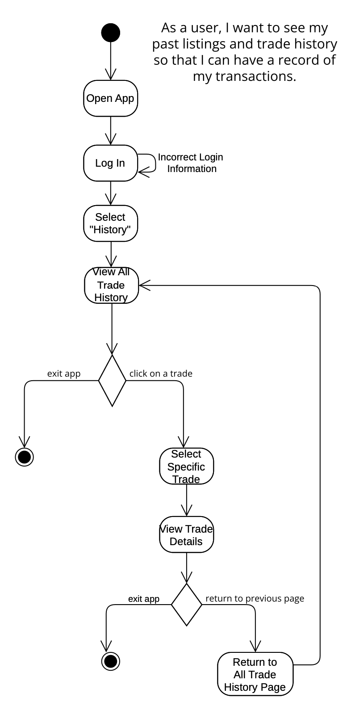

# Specification Phase Exercise

## Team members
[Oluwapelumi Adesiyan](https://github.com/oadesiyan)  
Gabriella Codrington  
[Nyjur Majok](https://github.com/nyjur1)  
[Ajok Thon](https://github.com/ajokt123) 

## Stakeholders
**Stakeholders:**  
Name: Sarah Hanun  
Year: Junior  
Major: Journalism  
Housing: On Campus Dorm  
Occupation: Resident Assistant  
Hometown: Las Vegas, Nevada

Sarah has plans of moving going back home to Las Vegas, for the Summer break and will not be returning as an RA in the Fall term.

**Problems/Frustrations:**
- Limited Storage & Packing Constraints
- Expensive Cost of Buying New Items Each Semester
- Last-Minute Rush to Give Away or Sell Items at the end of semester
- Having to throw away items she can not keep 

**Goals/Needs:**
- Easier Item Offloading Before Moving Out
- Affordable Access to Second-Hand Essentials
- Smaller student community of traders 
- Convenient and friendly pick up and drop off of items

## Product Vision Statement
Our app is a student-exclusive marketplace that allows NYU students to trade or give away essential items like textbooks, clothing, and dorm supplies, reducing waste and lowering costs within the campus community.

## User Requirements
1. As an NYU student, I want to contact other students so that I can negotiate the trade and the meeting spots with other students.
2. As a user, I want to be able to filter through the catalog so that I can find specific items that I want to trade for.
3. As a browser, I want to be able to view a brief description of the item so that I can determine if I want the item.
4. As a user, I want to be able to report suspicious listings so that I can keep the platform safe and usable.
5. As a user, I want to receive notifications when new items are listed so that I can stay up to date on what other users are offering.
6. As a lister, I want to be able to mark items as traded or available so that other users know what is still available to them.
7. As a user, I want to see my past listings and trade history so that I can have a record of my transactions.
8. As an international student, I want to quickly trade off items that are not of great importance so that I can travel inexpensively.
9. As a financially-challenged student, I want to exchange items with other students instead of purchasing new ones, so that I can budget efficiently.
10. As a compulsive buyer, I want to connect with other students, so that I can build a supportive network and let go of material possessions. 
11. As an under-calculator,  I want to track inventory lists of common essentials of my peers so that I can better understand my needs and avoid underbuying in the future. 
12. As a first-year student, I want access to essential resources such as textbooks from upperclassmen, so that I have an easier transition into the semester. 

## Activity Diagrams
__Story 8__: As an international student, I want to quickly trade off items that are not of great importance so that I can travel inexpensively.  

__Story 7__: As a user, I want to see my past listings and trade history so that I can have a record of my transactions.

## Clickable Prototype
[Clickable Prototype](https://www.figma.com/proto/mm1XY01lCteffMXzK5o66Q/The-Four-Loops?node-id=0-1&t=6RVIYX1wnGDgkG3A-1)
